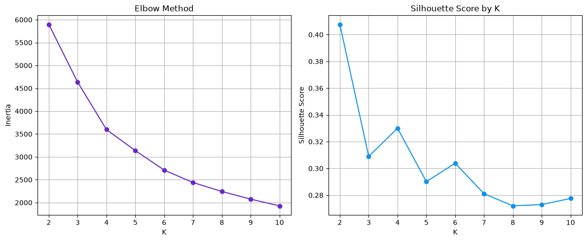

# RFM Preprocessing for K-Means — Notes

## The pipeline order

```
raw transactions → clean → aggregate to RFM (customer-level) → log-transform → scale → cluster
```

Each step depends on the one before it, so the order isn't optional:

1. **Clean transaction data** — drop cancelled invoices (`Invoice` starting with `C`),
   non-standard `StockCode` values, null `Customer ID`, non-positive `Price`.
2. **Aggregate to RFM** — one row per `Customer ID`:
   - `monetary_value` = sum(`Quantity * Price`)
   - `frequency` = count(distinct `Invoice`)
   - `recency` = days since last purchase (relative to a reference date, usually max date + 1)
3. **Log-transform** the skewed features (typically `monetary_value` and `frequency`).
4. **Scale** with `StandardScaler` — always last.

You can't scale before aggregating (there's no customer-level feature to scale yet), and
you can't scale before log-transforming (see below — scaling doesn't fix skew, only units).

## Why log-transform?

RFM features — especially `monetary_value` and `frequency` — are almost always heavily
right-skewed: most customers cluster near zero, and a handful of "whale" customers stretch
the distribution out to extreme values.

A log transform (`np.log1p`, i.e. `log(1 + x)`, so it handles zeros safely) compresses
large values much more than small ones. This pulls in the long right tail and makes the
distribution roughly symmetric — much closer to what distance-based algorithms expect.

## Why scale *after* log-transforming, not instead of it?

`StandardScaler` computes `(x - mean) / std`. This is a **linear** transformation — it
re-centers and rescales the data, but it does not change the *shape* of the distribution.
If the data is skewed with outliers before scaling, it is exactly as skewed after scaling,
just measured in different units.

This matters for K-Means specifically because:

- K-Means uses **Euclidean distance** to assign points to centroids.
- Centroids are computed as the **mean** of points in a cluster.
- Both distance and mean are sensitive to outliers/skew.

If you scale the raw skewed RFM data directly:
- The handful of extreme values inflate the `std` used by the scaler, which compresses
  the bulk of "normal" customers into a tiny range near 0.
- Cluster centroids get pulled toward the outliers during fitting.
- In practice, K-Means ends up carving out a tiny cluster for the whales and lumping
  everyone else together — not the meaningful segmentation you actually want.

Log-transforming first fixes the *shape* (skew), so that scaling afterward is scaling a
distribution where the mean/variance aren't dominated by a few extreme points.

**Rule of thumb: scaling fixes units, log-transform fixes shape. K-Means needs both when
the raw features are as skewed as retail RFM data typically is.**

## Handling extreme outliers (whales)

Even after log-transforming, a few genuine outliers (e.g. wholesale/B2B accounts with
monetary_value far beyond typical retail customers) may still warrant separate handling:
- Cap at a high percentile (e.g. 99th), or
- Segment them into a separate "VIP/wholesale" bucket rather than letting them influence
  the main customer clusters.

## Picking K

### Elbow method

For each K, K-Means computes **inertia** (a.k.a. WCSS — within-cluster sum of squares): the
sum of squared distances from each point to its assigned cluster's centroid.

- Inertia always decreases as K increases — more clusters means points sit closer to *some*
  centroid. At the extreme (K = number of points), inertia hits 0. So the goal isn't to
  minimize it — it's to find where **adding another cluster stops giving much benefit**.
- Early on, each new cluster splits genuinely distinct groups, so inertia drops sharply.
  Past a certain K, you're just subdividing existing groups arbitrarily, so the drop
  flattens out.
- **How to read it:** plot K (x-axis) vs. inertia (y-axis). Look for the "elbow" — the bend
  where the curve goes from steep to shallow. That K is a candidate.
- **Weakness:** the bend is often not sharp — sometimes it's a smooth curve with no obvious
  elbow, which is why it's paired with silhouette score rather than used alone.

### Silhouette score

For each point, measures: *how similar is this point to its own cluster, compared to the
nearest other cluster?*

- `a` = average distance to other points in its own cluster (cohesion — want this small)
- `b` = average distance to points in the nearest neighboring cluster (separation — want
  this large)
- silhouette = `(b - a) / max(a, b)`, ranges from **-1 to 1** per point, then averaged
  across all points for a given K.
  - **Close to 1** — point is well-matched to its own cluster, far from neighbors. Good.
  - **Close to 0** — point sits on the boundary between two clusters. Ambiguous.
  - **Negative** — point is probably in the wrong cluster.
- **How to read it:** plot K (x-axis) vs. average silhouette score (y-axis). Pick the K with
  the highest score, or the highest among K values that are also business-interpretable.

### Reading both together

- Elbow tells you where adding clusters stops being "worth it" in terms of variance
  reduction.
- Silhouette tells you which K actually produces well-separated, cohesive clusters — more
  decisive when the elbow bend is ambiguous.
- Ideal case: the elbow bend and the silhouette peak roughly agree — a strong signal. If
  they disagree, silhouette is generally more trustworthy, but always sanity-check that the
  resulting clusters make business sense (a high score with imbalanced/nonsensical clusters
  isn't useful — don't overfit K just to gain a marginal silhouette bump).

### Chosen K for this dataset: K=4



- The elbow plot shows a steep inertia drop from K=2→4, then flattens noticeably from K=5
  onward — the bend sits around K=4–5.
- The silhouette score peaks at K=2 (~0.41), but that's likely too coarse for RFM
  segmentation — with only 2 clusters you'd probably just be splitting "active vs.
  inactive" rather than getting actionable segments. The score drops sharply at K=3, then
  recovers to a genuine local peak at K=4 (~0.33) — that recovery pattern signals a real
  structural point in the data, not noise.
- K=6 has a smaller secondary bump (~0.30), but it sits past the elbow bend, in the region
  where additional clusters stop meaningfully reducing inertia — splits there read as more
  arbitrary than structural.
- **K=4 is where both signals agree** — the elbow bend and a genuine silhouette local peak
  — which is the strongest kind of evidence for choosing K over relying on either method
  alone.

## Validating the result

- Check cluster sizes — a wildly imbalanced split (e.g. one giant cluster + one tiny one)
  signals a problem.
- Profile each cluster's mean RFM values — do the segments make business sense?
- Turn cluster numbers into labels (e.g. "Champions", "At Risk", "Low-Value Frequent")
  based on the profile — that's the actual deliverable, not the raw cluster ID.
